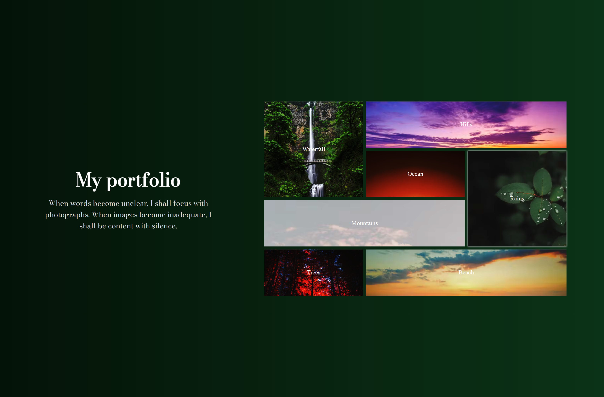

# 🎨 Grid Portfolio Gallery (HTML + CSS)

A modern grid-based portfolio layout built using pure HTML and CSS. It features beautiful transitions, background blending, and an elegant layout that mimics a photo journal or digital gallery.

---

## 🌟 Features

- Responsive layout using **CSS Grid**
- **Image-based boxes** with grid-row/column span
- Smooth **hover transitions** and background shift
- Custom Google Fonts (`Bodoni Moda`)
- Elegant background gradient with image blending
- Clean and minimal typography with a quote

---

## 🛠️ Technologies Used

- HTML5
- CSS3 (Grid, Transitions, Font Imports, Blend Modes)

---

## 🚀 How to Run

1. Clone or download the repo
2. Open `index.html` in your browser

---

## 📸 Preview

*(Add a screenshot like `grid-preview.png` in an `images/` folder and display it here)*

```markdown


